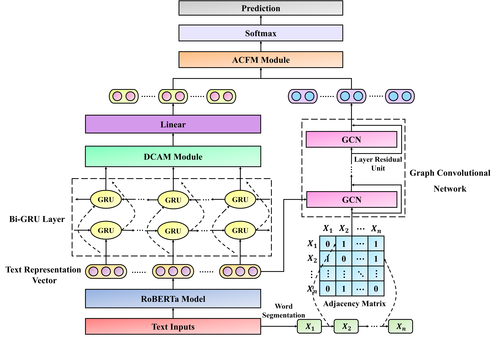

# MACFM
The source code for our [article](https://link.springer.com/article/10.1007/s10462-024-10835-x) "An effective multi-modal adaptive contextual feature information fusion method for Chinese long text classification".

Abstract:
Chinese long text classification plays a vital role in Natural Language Processing. Compared to Chinese short texts, Chinese long texts contain more complex semantic feature information. Furthermore, the distribution of these semantic features is uneven due to the varying lengths of the texts. Current research on Chinese long text classification models primarily focuses on enhancing text semantic features and representing Chinese long texts as graph-structured data. Nonetheless, these methods are still susceptible to noise information and tend to overlook the deep semantic information in long texts. To address the above challenges, this study proposes a novel and effective method called MACFM, which introduces a deep feature information mining method and an adaptive modal feature information fusion strategy to learn the semantic features of Chinese long texts thoroughly. First, we present the DCAM module to capture complex semantic features in Chinese long texts, allowing the model to learn detailed high-level representation features. Then, we explore the relationships between word vectors and text graphs, enabling the model to capture abundant semantic information and text positional information from the graph. Finally, we develop the AMFM module to effectively combine different modal feature representations and eliminate the unrelated noise information. The experimental results on five Chinese long text datasets show that our method significantly improves the accuracy of Chinese long text classification tasks. Furthermore, the generalization experiments on five English datasets and the visualized results demonstrate the effectiveness and interpretability of the MACFM model.

<p align="center">
	
</p>

# Datasets
The required dataset can be obtained here: [Google Drive](https://drive.google.com/drive/folders/1oLAgicyUg__DqXLQYshXgRMkWKoUVpGy?usp=sharing)

# How to run
To run the code, you can refer to the environment configuration information at [BertGCN](https://github.com/ZeroRin/BertGCN).

# Citation
If this repository is helpful for your research, we'd really appreciate it if you could cite the following paper:
```
@article{xu2024effective,
  title={An effective multi-modal adaptive contextual feature information fusion method for Chinese long text classification},
  author={Xu, Yangshuyi and Liu, Guangzhong and Zhang, Lin and Shen, Xiang and Luo, Sizhe},
  journal={Artificial Intelligence Review},
  volume={57},
  number={9},
  pages={233},
  year={2024},
  publisher={Springer}
}
```
